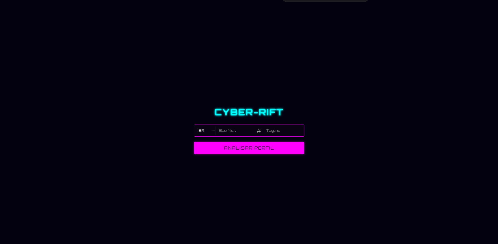
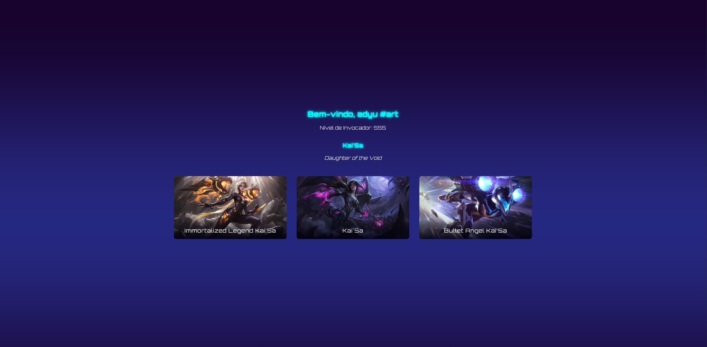

# Cyber-Rift

Uma aplicação web interativa que permite aos jogadores de League of Legends visualizarem seu campeão de maior maestria (Main Champion) e suas skins em um carrossel dinâmico, com um fundo 3D que reage em tempo real às cores da arte do campeão.

---

### ✨ Showcase Visual


| Página Inicial                        | Tela de Showcase (Desktop)              |
|---------------------------------------|-----------------------------------------|
|  |  |

---

### 🚀 Funcionalidades Principais

* **Busca por Riot ID:** Encontra qualquer jogador através do seu `Nick` + `Tagline`.
* **Proxy Seguro:** Um servidor backend em Bun/Elysia protege a chave da API da Riot, garantindo que ela nunca seja exposta no frontend.
* **Identificação do Main Champion:** O servidor identifica automaticamente o campeão com mais pontos de maestria.
* **Carrossel de Skins Responsivo:** Todas as skins do campeão são exibidas em um carrossel que se adapta a desktops e dispositivos móveis.
* **Background 3D Reativo:** Um fundo interativo criado com React Three Fiber que extrai a paleta de cores da skin selecionada e atualiza seu próprio gradiente em tempo real.

---

### 🛠️ Tech Stack

**Backend**
* **Runtime:** [Bun](https://bun.sh/)
* **Framework:** [ElysiaJS](https://elysiajs.com/)
* **Validação:** [Zod](https://zod.dev/)

**Frontend**
* **Framework:** [React 19](https://react.dev/)
* **Build Tool:** [Vite](https://vitejs.dev/)
* **Linguagem:** [TypeScript](https://www.typescriptlang.org/)
* **Data Fetching:** [TanStack Query](https://tanstack.com/query)
* **Roteamento:** [React Router](https://reactrouter.com/)
* **3D/Gráficos:** [React Three Fiber](https://docs.pmnd.rs/react-three-fiber/getting-started/introduction) + [Drei](https://github.com/pmndrs/drei)
* **Carrossel:** [Embla Carousel](https://www.embla-carousel.com/)
* **Extração de Cores:** [Node-Vibrant](https://github.com/akfish/node-vibrant)

---

### 🏛️ Arquitetura

O projeto segue os princípios da **Clean Architecture**, separando as responsabilidades em camadas distintas (`domain`, `application`, `presentation`, `infrastructure`).

A comunicação com a API da Riot é feita exclusivamente através de um **servidor proxy**. O frontend chama apenas os endpoints do nosso próprio servidor (`/api/...`), que por sua vez faz as chamadas seguras para a Riot, injetando a API Key. Isso previne a exposição de chaves sensíveis no lado do cliente.

---

### ⚙️ Configuração e Instalação Local

Siga os passos abaixo para rodar o projeto na sua máquina.

**1. Pré-requisitos**
* Garanta que você tem o [Bun](https://bun.sh/docs/installation) instalado.

**2. Clone o Repositório**
```bash
git clone <URL_DO_SEU_REPOSITORIO>
cd cyber-rift
```

**3. Instale as Dependências**
```bash
bun install
```

**4. Configure as Variáveis de Ambiente**
* Copie o arquivo de exemplo `.env.example` para um novo arquivo chamado `.env`.
    ```bash
    cp .env.example .env
    ```
* **Obtenha sua chave da API da Riot:**
    1.  Vá para o [Riot Developer Portal](https://developer.riotgames.com/) e faça login com sua conta da Riot.
    2.  Clique em "Register Project" e depois "Register App". Preencha os detalhes (para uso pessoal, as informações podem ser simples).
    3.  Após o registro, você receberá uma "Development API Key".
    4.  **Importante:** Esta chave expira a cada 24 horas. Você precisará gerar uma nova se a sua parar de funcionar.
* Abra o arquivo `.env` e cole sua chave na variável `RIOT_API_KEY`.
    ```env
    RIOT_API_KEY="RGAPI-xxxxxxxx-xxxx-xxxx-xxxx-xxxxxxxxxxxx"
    PORT=3001
    ```

**5. Rode o Projeto**
```bash
bun dev
```
* O frontend estará disponível em `http://localhost:5173`.
* O servidor proxy estará rodando em `http://localhost:3001`.

---

### 📜 Scripts Disponíveis

* `bun dev`: Inicia o servidor de desenvolvimento para o cliente (Vite) e o servidor proxy (Elysia) simultaneamente.
* `bun build`: Compila e otimiza a aplicação para produção.
* `bun lint`: Executa o ESLint para analisar o código em busca de erros e problemas de estilo.
* `bun typecheck`: Verifica todo o projeto em busca de erros de tipagem do TypeScript.
